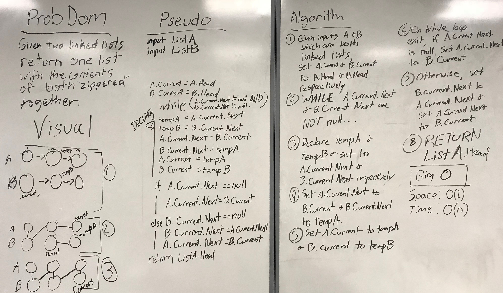

# Linked List Kth Index from List End

## Challenge

Given two linked lists as parameters, create a method that merges the lists, alternating between lists.

## Approach and Efficiency

* Time: O(n)
* Space: O(1)

Time: The Merge method has to traverse at least one of the linked lists passed into it in its entirety, so this is O(n).

Space: The number of variables required is constant. This method does not need to create a new linked list.

## Solution

