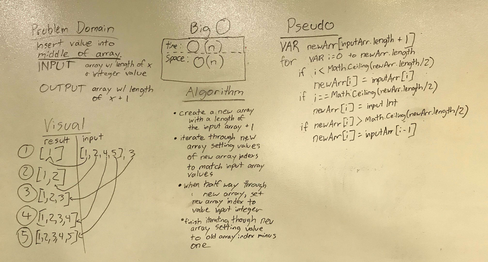

# Shift Array

## Challenge

Given an array of integers and an individual integer, return an array that inserts the individual integer in the middle of the array.

## Approach and Efficiency

* Time: O(n)
* Space: O(n)

Because C# doesn't allow for changing the length of the array, a new array must be created within the method. The created array will be directly correlated to the length of the input array (it will always have one more index than the input.)

## Solution

