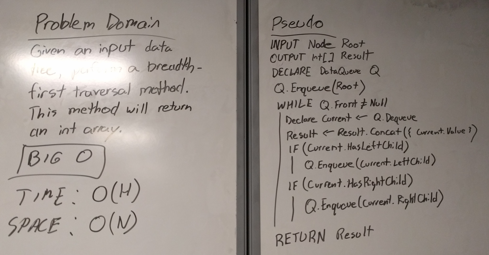

# Breadth First Tree Traversal

## Challenge

Given a tree root, traverse an entire data tree in a breadth-first traversal pattern.

## Approach

Given that I wanted to make this method as easy to test as my previous data tree traversal methods, this method also returns an array. I decided to have this method return an array of integers since the values of all of the nodes should only ever be integers.

This method also utilizes a queue. This was an interesting challenge as I'd made both tree and queue data structures take in nodes, but each one requres a node in a different format. I combined the Node properties in a special Node class just for this project and made a minor adjustment to the Enqueue method so that it can handle enqueueing Nodes into an empty Queue (probably something I should have added to the orginal method anyway.)

## Testing

I only wrote one test for this method that ensures all of the integers get output in the proper order (due to the way my Add() method works on the tree, this should always output the integers in the order they were added.)

## Efficiency

Time: O(h)
Space: O(n)

I'm pretty sure one of these is Big O of 'h' and one is Big O of 'n' but I'm not sure which is which and I'm not sure if there is even a meaningful difference between the two.

## Whiteboard

