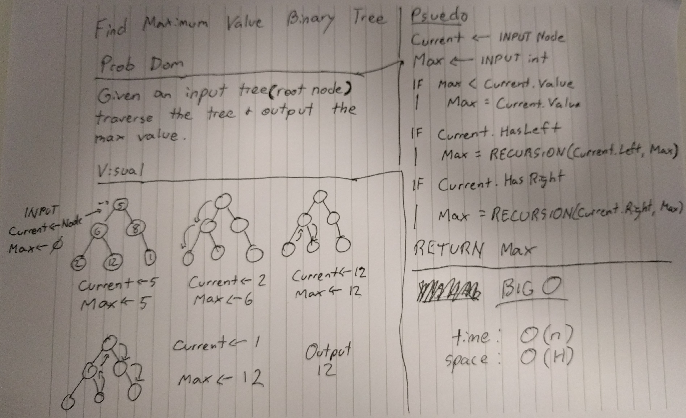

# FizzBuzz Trees

## Challenge

Given an input of a tree (really just a root node being passed in) traverse the tree, check each node and return the largest value.

## Approach

I decided that to make this method work, it would need to call itself recursively and that it would also need to accept a second parameter that would be an integer which would retain the largest value.

The max integer argument that gets passed defaults to 0 so that anyone using it doesn't need to remember to pass zero in themselves. As far as a user is concerned, they only need to pass the root node of the tree they want searched. I suppose this method could be used to check if there are any integers higher than a value passed as a second argument if a user wanted to use it that way.

## Testing

This program has one test that ensures the largest value in the node tree is returned. It's basically the same test that the demo runs.

## Efficiency

Time: O(n)
Space: O(h)

I remain unsure of which one is Big O of 'h' and one is Big O of 'n' and I'm still not sure what, if any, meaningful difference there is between the two.

## Whiteboard

