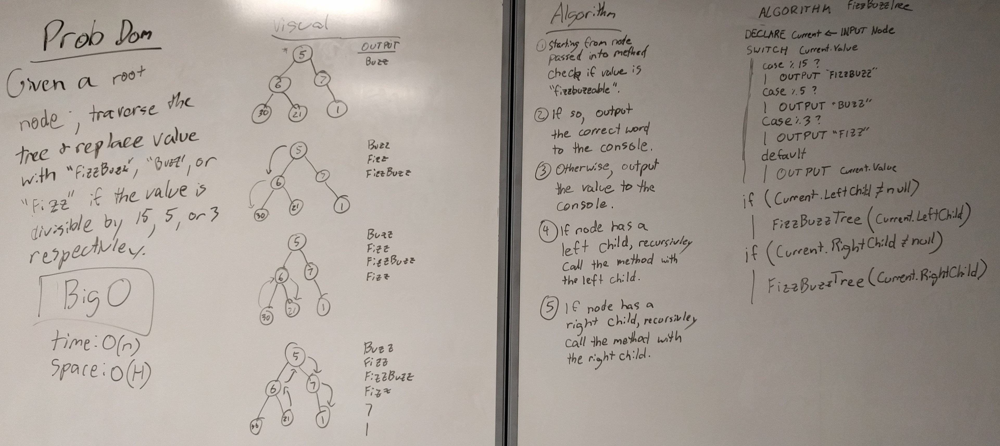

# FizzBuzz Trees

## Challenge

This challenge is a variation on the "FizzBuzz" challenge. However, instead of just counting up and replacing certain numbers with "Fizz", "Buzz", or "Fizzbuzz", we have to traverse a data tree and and output either the numerical value of a particular node, or one of the "FizzBuzz" words if the number is divisible by 3, 5, or both.

## Approach

I was told that we didn't need our method to return anything, but that would make for a method that's really hard to test. Plus I spent so much time getting my tree traversal methods to return arrays that I figured I should use what I learned and do that again.

This will traverse the data tree in pre-order sequence (that is, it checks the root first, then the left child, and finally the right.) The method takes in a node (presumably the root of a tree) and returns and array of strings.

## Testing

I only wrote one test for this method that ensures all of the proper strings get returned and in the proper order.

## Efficiency

Time: O(n)
Space: O(h)

Not entirely sure on this one, but I'll take a stab at it. This method is O(n) for time as it recursively calls itself sequentially to get data from all of the nodes. Space is O(h) where h is the height of the data tree.

## Whiteboard

