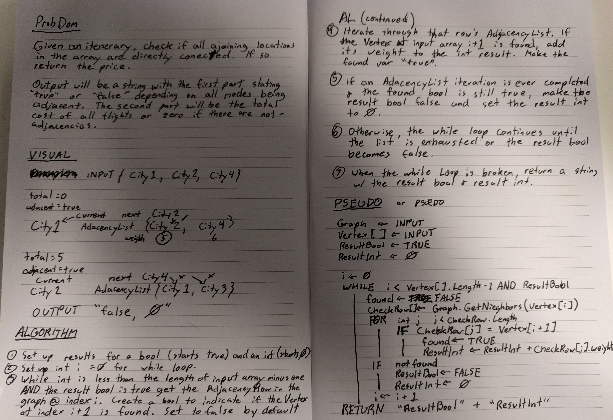

# Get Edges

## Challenge

Given a Graph and an array of Vertecies, return a string indicating whether or not all of the Vertecies in the array are adjacent to the Vertex at the index immediately after it. If they all are, return a sum of all of the adjacency's weights.

## Approach

The way I set up my Graph objects made this somewhat easy. For every Vertex in the array grab the adjacency row in which the KeyVertex is that Vertex. This is done by using the Graph's built-in GetNieghbors method with the Vertex passed in as an argument.

We save the resulting array from that method to a variable and check it for a Vertex that matches the Vertex in the input array immediatly after the Vertex we got the adjacency row for. If it's found, we want to add its weight to a variable declared at the begining of the algorithm. 

If we ever don't find a match, we want to set that total back to 0 and set a resulting boolean to false. We want to return a string with the boolean and integer at the end.

## Testing

The test suite has three tests...
1. A test to ensure that the string contains "true" when it should.
1. A test to ensure that the string contains "false" when it should.
1. A test to ensure that the total is calculated correctly when there are more than two nodes and the algorithm returns true.

## Efficiency

Time: O(n^2)
Space: O(n)

Because we do need to declare variables containing arrays and that the length of those arrays are dependant on the input, the space is likely O of n. Time might be O of n^2 because not only to we have to iterate over the input array, but we also have to iterate over adjacency row arrays that might vary in size.

## Whiteboard

