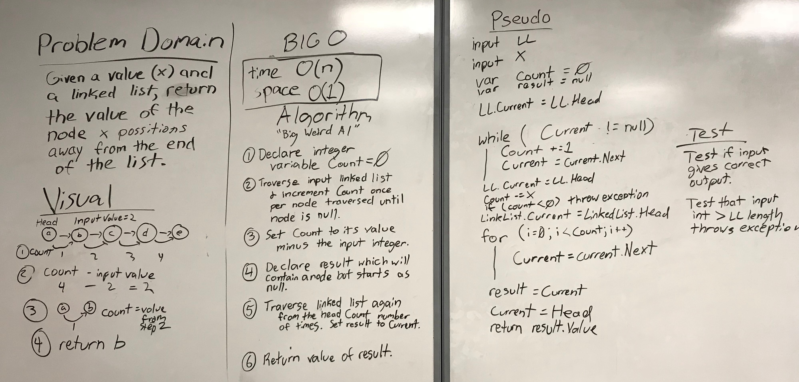

# Linked List Kth Index from List End

## Challenge

Given an input integer (k) and linked list, return the value of the node k positions away from the end of the list.

## Approach and Efficiency

* Time: O(n)
* Space: O(1)

Time: This requires going through the linked list twice. Not fantastic, but still just O(n). 

Space: The number of variables required is constant. There is no need to create a new array or list.

## Solution

