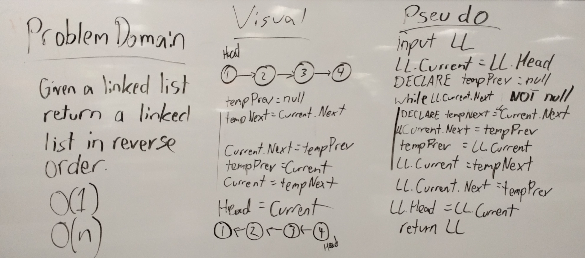

# Linked List Kth Index from List End

## Challenge

Given a linked list, return the same list with all of the nodes inside in the opposite order they were in originally.

## Approach and Efficiency

* Time: O(n)
* Space: O(1)

Time: The ReverseLL method needs to traverse the entire list passed into it once.

Space: This method does not need to create a new linked list. The list is reversed in place.

## Solution

This method works by traversing the Linked List, starting from the Head. As the list is traversed, the Current node's Next property is saved into a 'tempNext' variable before setting the Current.Next property to the Node previous (which gets saved into a 'tempPrev' variable each iteration and starts at null).
When the loop terminates, the Current node will be the node that was the end of the list before. It's Next property is set to the tempPrev variable and the Head is set equal to the Current node, making the end the new Head and completing the reversal. 

