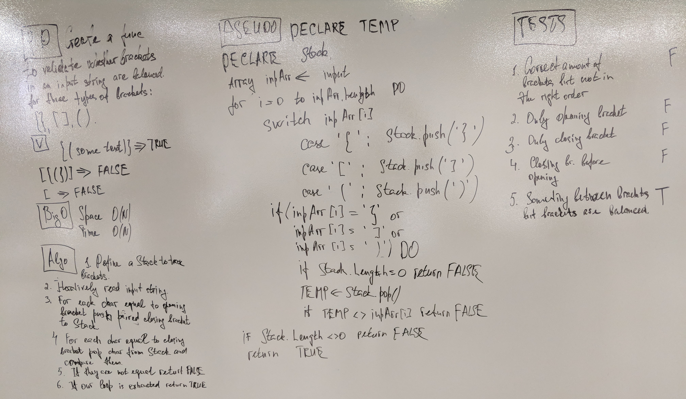

# Multi Bracket Validator

## Challenge

This challenge requires creating a method that will take in a string and evaluate whether or not it uses all of its square brackets "[]", curley braces "{}", and parentheses "()" properly. The strings should have matching opening and closing brackets in the correct order to pass. For example...

"Hello, I am (somewhat) well today" will return true.

"Oh my, I seem to be} missing a bracket" will return false.

## Classes

This challenge uses a Stack class from a previous challenge. The stack is a data structure with a First In First Out structure.

## Approach

The method instantiates and empty stack to record instances of closing brackets which get added to the stack when an opening bracket is found and popped off of the stack when the matching closing bracket is found. If a closing bracket is found that doesn't match the one on top of the stack, or if there isn't anything on the stack when this happens, the method returns false.

While first creating the whiteboard, the original idea was to iterate through all chars in the string. However, we can break out of the stack as soon as anything that would make it false is found, so I also declare a "result" variable at the start of the method that starts as true. Instead of a for loop, I put the string through a while loop that keeps going until we reach the end of the string, or until "result" is made false.

Once the while loop is escaped, we make one more check to see if there is anything left on the stack as it should be empty again once we're out of the while loop. If it's not result it marked false. Either way, we return the result.

## Testing

This program features a test suite testing that string with a proper use of brackets/parens or strings with no brackets/parens at all return true. 

I also test that any instances of strings missing a bracket or paren (either an opening or closing) return false.

Finally, I test that strings with the right amount of brackets/parens but have them in the wrong order also return false.

## Efficiency

Time: O(n)
Space: O(n)

Time is O(n) because the method needs to iterate up to the entire string if the string returns true. I tried to make my method a little more efficient by iterating over the string itself, instead of converting it to an array, but this still leaves us with O(n) for space, because the amount of nodes getting pushed to the stack to make the method work will vary by the number of brackets/parens in the string.

## Whiteboard

