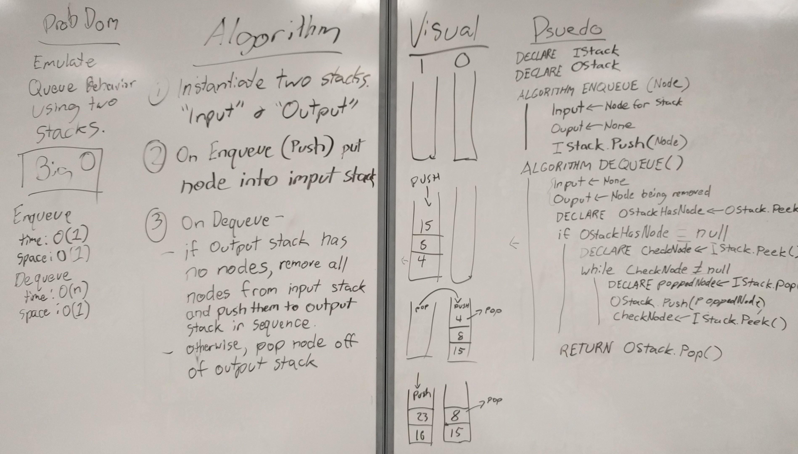
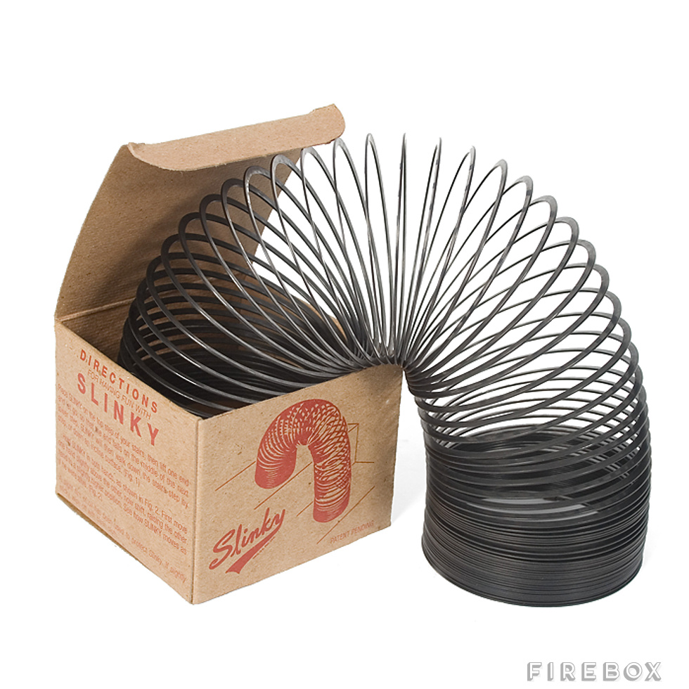

# Emulating Queue Behavior using Two Stacks

## Challenge

The objective of this challenge is to emulate the behavior of queues with a pair of stacks instead. In case these are new terms to you, I'll describe them below.

Stack: A stack is a data structure that impliments a first in last out (or FILO) structure in which case the nodes placed in it are stacked on top of each other. The node on top is accessable using the Peek() method and nodes underneith cannot be acessed without the nodes on top of it being removed first. This data structure also features a Push() method for adding nodes to the stack and a Pop() method for removing the node at the top.

Queue: Conversely, a queue features a first in first out (or FIFO) structure in which case data flows in one direction. The first node placed into the queue will be the first one removed. This structure features a Peek() method that will return the node in front of the queue, an enqueue method that will place a node to the rear of the queue and a dequeue method that will remove the node at the front of the queue.

Here we will be emulating the behavior of a queue (that is a FIFO structure) but using a pair of stacks instead of a queue.

## Approach

To achieve this, we will instantiate two empty stacks. One will serve as our input stack and the other will serve as our output stack. When we need to enqueue a node onto our stacks, we simply perform the Push() method on the input stack with the node we want to add passed as an argument.

Getting the functionality for the dequeue method is a little trickier. We'll need to Pop() a node off of the output stack. However, if the output stack is empty (as it will be at the start for example) we need to dump the contents of the input stack into the output stack by sequentially using the Pop() method on the input stack and using the Push() method on the output stack passing the node that was just taken from the input stack as an argument. Once the input stack is empty, we can Pop() a node off of the output stack and return its value, as it will now be the node that was first in the previous input stack.

This action will not need to be performed again until the output stack is emptied once again.

You could think of it as dumping out one stack into another. It's a process I like to think of as Slinky-ing!

## Testing

This program features a test suite testing for the following...

1. That the stacks are properly instatiated and that the EnqueueWithStacks method works,
2. That the DequeueWithStacks method works, leaving the input stack empty
3. That the two methods work properly with each other, effectively keeping track of a Front and Rear node just as a queue would.

## Efficiency

Time: O(1) Enqueue O(n) Dequeue
Space: O(1) Enqueue and Dequeue

Because there are a fixed number of variables created for each method, all of them are time O(1). Enqueue is space O(1) but dequeue is space O(n) because it may have to go through one of the stacks entirely to produce the desired result.

## Visual Aids

The following visual aids are included: A whiteboard diagram explaining the methods, a screenshot of the console app demo, and a reference slinky. Slinky picture courtesy of [The Therapy Store](http://www.thetherapystore.com.au/product/slinky-metal-original-50-mm/).

