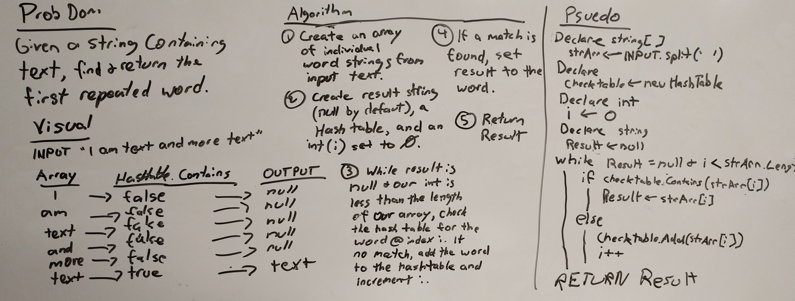

# Repeated Words

## Challenge

Given a string containing text, find and return the first repeated word from the string.

## Approach

I'm using a hash table data structure to make this task a bit easier. The method breaks up the input text into an array of strings containing an individual word. I also create a hashtable for our words to be hashed and stored, a result string for our final returned result to live in (this is set to null initially) and an int variable (i) that starts at zero. I could have just used a for loop, but I decided a while loop was better since I want to break out of it if either we reach the end of the list, or we find a repeated word.

We then iterate through the array, checking to see if the word is already a key on our hash table. If it's not, we add a new node to the hash table with the key and value both equal to the word (the value is not actually important, we just need one to create the node.) 

If we do find a match, we just set result to that word (thus breaking us out of our while loop early) and then we return the result.

If we get all the way through our list and never find a result, we just return null.

## Testing

Not many tests for this one. I basically just want to make sure that we return the correct values from the method based on the input string, or that we get null if there are no repeated words.

## Efficiency

Time: O(n)
Space: O(n)

Probably?

## Whiteboard

