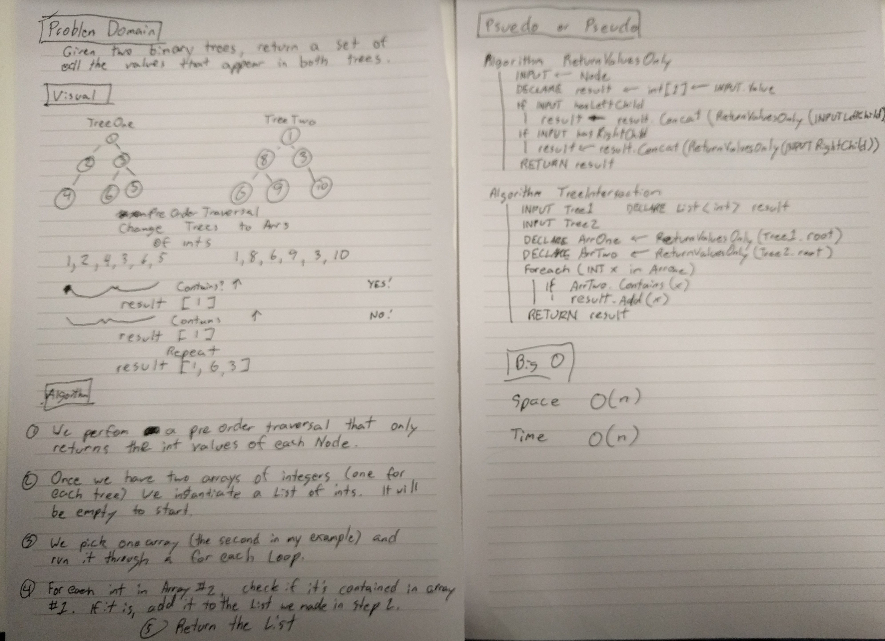

# Tree Intersections

## Challenge

Given two binary trees, return a list of integers which contain values that are present in both trees.

## Approach

I thought about using the built-in traversal methods I'd already created for binary trees, but seeing as how the goal is to just return a list of integers, I made a custom method that returns the values of the nodes instead of the entire node. I also created a method to make it easier to create a binary tree for testing purposes that can just take in an array and make nodes out of them (granted they will always have a root with a node value of 6 since trees have to be instantiated with a root node. I thought about fixing this, but since this method is really just used for testing, I thought "ah the heck with it".) 

The TreeIntersection method itself starts by creating the integer arrays out of the two trees passed in as arguments, then it iterates through one of the arrays and pushes each value into a list if that value is contained within the other array. Once the array has been iterated over, the 

## Testing

I wrote one test for each custom method in the Program. As mentioned earlier, one of the methods is just for creating trees quickly out of arrays for testing purposes, but I wrote a test for it anyway. The traversal method that returns an array of integers is called twice in the TreeInteresection method (once on each tree passed into the method) and the TreeIntersection method handles the problem domain. All tests pass.

## Efficiency

Time: O(n)
Space: O(n)

I'm completely guessing here. I have no idea.

## Whiteboard

